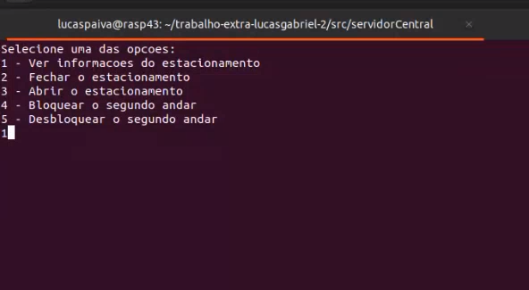
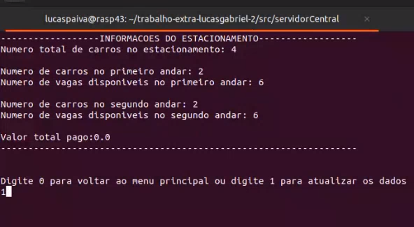
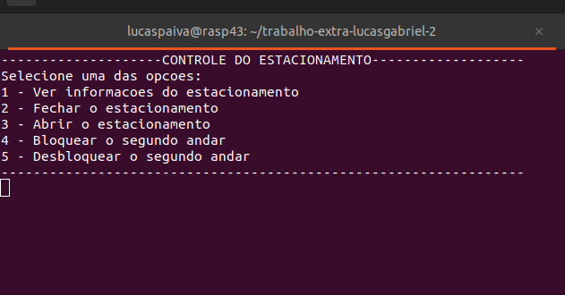
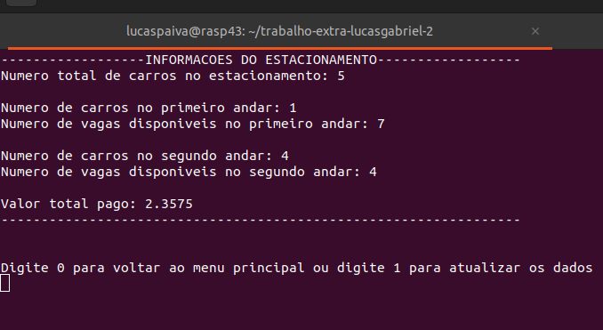

# Trabalho 1 - Fundamentos de Sistemas Embarcados

## Aluno

| Matrícula  | Aluno                                                                   |
|------------|-------------------------------------------------------------------------|
| 19/0112123 | [Lucas Gabriel Sousa Carmargo Paiva](https://github.com/lucasgabriel-2) |

## Sobre

Nesse repositório está um dos trabalhos realizados durante a disciplina de Fundamentos de Sistemas Embarcados da Universidade de Brasília, com intuito de desenvolver um sistema distribuído para o controle e monitoramento de estacionamentos comerciais. Dentre os itens controlados teremos a entrada e saída de veículos, a ocupação de cada vaga individualmente, a ocupação do estacionamento como um todo e a cobrança por tempo de permanência. [1]

O sistema foi desenvolvido para funcionar em um conjunto de placas Raspberry Pi com um servidor central responsável pelo controle e interface com o usuário e servidores distribuídos para o controle de todos os sensores e atuadores de cada andar do estacionamento. [1]

## Instalação e execução

Para rodar o projeto, basta executar cada um dos servidores (utilizando um terminal diferente para cada servidor). Para isso basta utilizar os comandos abaixo na raiz do projeto, você pode iniciar cada servidor em qualquer ordem.

1 - Executando o servidor Central

    cd src/servidorCentral/ && python3 servidorCentral.py

2 - Executando o servidor Distribuído do Primeiro Andar

    cd src/servidorDistribuido/ && python3 servidorPrimeiroAndar.py

3 - Executando o servidor Distribuído do Segundo Andar

    cd src/servidorDistribuido/ && python3 servidorSegundoAndar.py

## Screenshots

### Interfaces

#### Interface de comandos

 Figura 1 - Menu principal.

#### Interface com informações do estacionamento

 Figura 2 - Menu secundário.

## Apresentação

<video src='./assets/gravacao.mp4'></video>

[Arquivo de apresentação](./assets/gravacao.mp4)

* Observação: após a apresentação foi corrigido um bug que não contabilizava o valor pago por carros no primeiro andar, foi implementado também Locks da biblioteca threading para evitar o acesso do mesmo arquivo por mais de uma thread ao mesmo tempo e uma pequena atualização gráfica no menu principal, essas atualizações podem ser observadas com mais detalhes a seguir:

 <a>Atualizações</a> 

### Interfaces atualizadas

#### Interface de comandos atualizada

 Figura 3 - Menu principal atualizado.

#### Interface com informações do estacionamento atualizada

 Figura 4 - Menu secundário atualizado.

## Apresentação das correções

<video src='./assets/gravacao-correcao.mp4'></video>

[Arquivo de apresentação da correcao](./assets/gravacao-correcao.mp4)

## Outros

### Observação sobre o funcionamento de cada json

#### Envio de mensagem dos distribuídos para o central

- jsonCentralPrimeiroAndar.json: servidor central recebe mensagens do primeiro andar 
- jsonCentralSegundoAndar.json: servidor central recebe mensagens do segundo andar 

- jsonPrimeiroAndar.json: servidor distribuído do primeiro andar altera para enviar para o central
- jsonSegundoAndar.json: servidor distribuído do segundo andar altera para enviar para o central

#### Envio de mensagem do central para os distribuídos

- jsonComandoCentralPrimeiroAndar.json: servidor central altera para enviar para o servidor distribuído do primeiro andar
- jsonComandoCentralSegundoAndar.json: servidor central altera para enviar para o servidor distribuído do segundo andar
- jsonCentralPrimeiroAndar.json: servidor do primeiro andar distribuído recebe mensagens do central
- jsonCentralSegundoAndar.json: servidor do segundo andar distribuído recebe mensagens do central

* Observação: Caso execute uma vez o projeto e deseje executar novamente é necessário resetar os arquivos .jsons presentes no diretório `src/comunicacaoJson` (pois eles vão possuir informações referentes a última vez que o projeto foi executado). Para isso é simples, basta copiar esse mesmo diretório `src/comunicacaoJson` presente nesse repositório do GitHub e substituir o que você que você possui localmente pela cópia.

### Data de entrega 

## Referências

[1] Fundamentos de Sistemas Embarcados - Trabalho 1 - 2023-1. Disponível no [link](https://gitlab.com/fse_fga/trabalhos-2023_1/trabalho-1-2023-1), acesso em 26/12/2023.  

